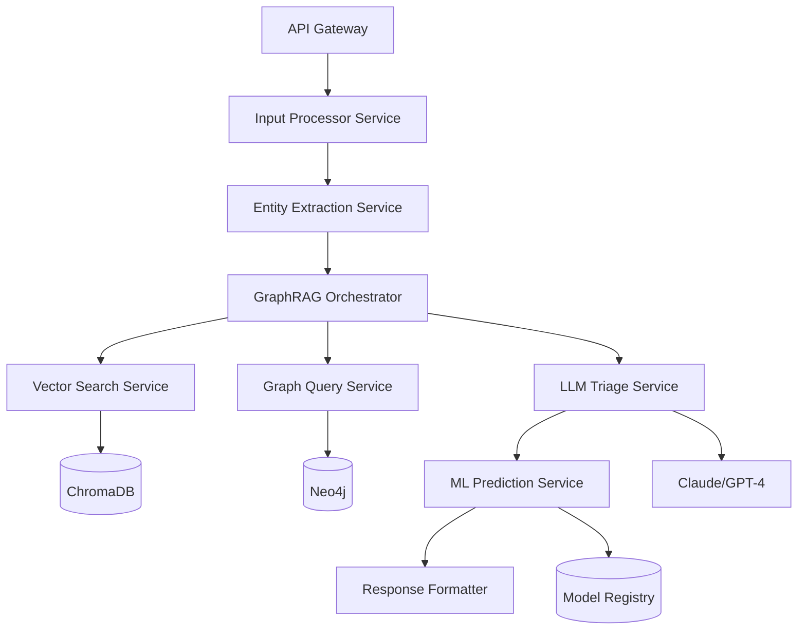

# Service-Sense: Intelligent Triage & Predictive Resolution System PRD
## Version 2.0 - Enhanced & Production-Ready

---

## Executive Summary

Service-Sense transforms Seattle's fragmented customer service request system into a transparent, predictable, data-driven experience using a hybrid GraphRAG + ML architecture. The system provides citizens with instant, accurate service categorization, predicted resolution times with confidence intervals, and clear justifications based on open data and historical metrics. This initial version focuses on English-language support only.

### Key Business Metrics
- **Target Triage Accuracy**: >95% correct department routing
- **Target Prediction Accuracy**: ±3 days MAE for resolution times
- **Target Response Time**: <500ms for API response
- **Target User Satisfaction**: >85% accuracy rating from users

---

## 1. Problem Statement & Solution Overview

### Current State Problems
1. **Fragmented Request System**: Citizens don't know which department handles their issue
2. **Unpredictable Resolution Times**: No visibility into when issues will be resolved
3. **Misrouted Requests**: 18% of requests get transferred between departments
4. **Channel Confusion**: Multiple submission channels with inconsistent categorization

### Proposed Solution
A unified AI-powered triage system that:
- Accepts natural language input (text or voice)
- Automatically categorizes to the correct service type and department
- Predicts resolution time based on historical patterns
- Provides transparent reasoning for all decisions

---

## 2. Data Integration & Field Mapping

### 2.1 Seattle Open Data Fields (Dataset: 5ngg-rpne)

Based on the actual Customer Service Requests dataset, here are the 16 fields we'll integrate:

| Field Name | Data Type | Description | Usage in System |
|------------|-----------|-------------|-----------------|
| `servicerequestnumber` | String | Unique ID (e.g., "20-00000006") | Primary key for tracking |
| `webintakeservicerequests` | String | Service request type name | Target for classification |
| `departmentname` | String | Full department name | Department routing |
| `createddate` | DateTime | Request creation timestamp | Feature for ML model |
| `methodreceivedname` | String | Submission channel | Feature for priority/routing |
| `servicerequeststatusname` | String | Current status | Training label filtering |
| `location` | String | Full address text | Geocoding & district extraction |
| `x_value` | Float | State Plane X coordinate | Spatial analysis |
| `y_value` | Float | State Plane Y coordinate | Spatial analysis |
| `latitude` | Float | WGS84 latitude | Location features |
| `longitude` | Float | WGS84 longitude | Location features |
| `latitude_longitude` | Point | Combined lat/long | Spatial indexing |
| `zipcode` | String | 5-digit ZIP code | Demographic features |
| `councildistrict` | String | Council district number | Political priority features |
| `policeprecinct` | String | Police precinct name | Emergency routing |
| `neighborhood` | String | Neighborhood name | Hyperlocal patterns |

### 2.2 Data Quality & Preprocessing Requirements

#### Language Requirements
- **English-only processing**: System accepts input only in English
- **No translation services**: Future versions may include multi-language support
- **Voice input**: English speech recognition via WhisperX with English language model
- **Text normalization**: English-specific text processing (contractions, spelling corrections)

#### Missing Data Handling
- **Location fields**: 23% have missing coordinates → Use geocoding API for address field
- **Neighborhood**: 15% missing → Infer from ZIP code or council district
- **Status updates**: Create derived field for resolution date when status = "Closed"

#### Service Type Normalization
```python
SERVICE_TYPE_MAPPING = {
    # Original → Normalized
    "Graffiti": "GRAFFITI_REMOVAL",
    "Graffiti - Offensive": "GRAFFITI_REMOVAL_PRIORITY",
    "Pothole in Street": "SDOT_POTHOLE",
    "Pothole - Damage Claim": "SDOT_POTHOLE_CLAIM",
    "Illegal Dumping": "SPU_ILLEGAL_DUMPING",
    "Abandoned Vehicle": "PARKING_ABANDONED_VEHICLE",
    # ... 150+ mappings
}
```

---

## 3. Technical Architecture - Detailed Components

### 3.1 Microservices Architecture



### 3.2 Service Specifications

#### Input Processor Service
**Purpose**: Handle multimodal input and standardize to text
```python
class InputProcessor:
    def __init__(self):
        self.whisper_model = WhisperX(model="large-v3", language="en")
        self.text_cleaner = TextNormalizer()
    
    async def process(self, input_data: Union[str, bytes]) -> ProcessedInput:
        if is_audio(input_data):
            transcript = await self.whisper_model.transcribe(
                input_data,
                language="en"  # English-only transcription
            )
            return ProcessedInput(
                text=transcript.text,
                confidence=transcript.confidence
            )
        return ProcessedInput(text=self.text_cleaner.normalize(input_data))
```

#### Entity Extraction Service
**Purpose**: Extract structured entities from natural language
```python
EXTRACTION_PROMPT = """
Extract the following entities from the user's service request:

User Input: {user_input}

Return a JSON with:
- location: street address or landmark
- location_type: "address" | "intersection" | "landmark" | "area"
- service_keywords: list of relevant service terms
- urgency_indicators: list of urgent/safety keywords
- temporal_context: any time references (e.g., "since last week")
- affected_count: estimated number of people affected
- damage_severity: "minor" | "moderate" | "severe" | null
"""
```

#### GraphRAG Orchestrator
**Purpose**: Coordinate hybrid retrieval from vector and graph databases

```python
class GraphRAGOrchestrator:
    def __init__(self):
        self.vector_db = ChromaClient()
        self.graph_db = Neo4jClient()
        self.context_merger = ContextMerger()
    
    async def retrieve_context(self, entities: ExtractedEntities) -> UnifiedContext:
        # Parallel retrieval
        vector_results, graph_results = await asyncio.gather(
            self.vector_search(entities),
            self.graph_search(entities)
        )
        
        # Intelligent merging with deduplication
        return self.context_merger.merge(
            vector_results, 
            graph_results,
            strategy="weighted_relevance"
        )
```

---

## 4. Enhanced Neo4j Graph Schema

### 4.1 Node Types & Properties

```cypher
// Core Entities
(:Service {
    code: String,           // e.g., "SDOT_POTHOLE"
    name: String,           // e.g., "Pothole Repair"
    description: String,
    priority: Integer,      // 1-5 scale
    sla_days: Integer,      // Service level agreement
    requires_photo: Boolean,
    requires_exact_location: Boolean
})

(:Department {
    acronym: String,        // e.g., "SDOT"
    full_name: String,      // e.g., "Seattle Department of Transportation"
    director: String,
    phone: String,
    email: String,
    website: String
})

(:Neighborhood {
    name: String,           // e.g., "CAPITOL HILL"
    council_district: Integer,
    population: Integer,
    area_sq_miles: Float,
    median_income: Integer
})

(:ServiceRequest {
    number: String,         // e.g., "20-00000006"
    created_date: DateTime,
    closed_date: DateTime,
    resolution_days: Integer,
    status: String,
    method_received: String
})

// Supporting Entities
(:Keyword {
    text: String,
    category: String        // "symptom" | "object" | "action"
})

(:Season {
    name: String,           // "winter" | "spring" | "summer" | "fall"
    start_month: Integer,
    end_month: Integer
})

(:ResolutionPattern {
    pattern_id: String,
    mean_days: Float,
    std_dev: Float,
    sample_size: Integer,
    last_updated: DateTime
})
```

### 4.2 Relationships

```cypher
// Service relationships
(s:Service)-[:HANDLED_BY]->(d:Department)
(s:Service)-[:HAS_KEYWORD]->(k:Keyword)
(s:Service)-[:COMMON_IN]->(n:Neighborhood)
(s:Service)-[:PEAKS_IN]->(season:Season)

// Request relationships
(r:ServiceRequest)-[:FILED_FOR]->(s:Service)
(r:ServiceRequest)-[:LOCATED_IN]->(n:Neighborhood)
(r:ServiceRequest)-[:RESOLVED_BY]->(d:Department)

// Pattern relationships
(s:Service)-[:HAS_PATTERN {
    conditions: String  // JSON of conditions
}]->(p:ResolutionPattern)
```

---

## 5. Machine Learning Pipeline - Production Grade

### 5.1 Feature Engineering Pipeline

```python
class FeatureEngineering:
    def __init__(self):
        self.encoders = {}
        self.scalers = {}
        
    def engineer_features(self, df: pd.DataFrame) -> pd.DataFrame:
        features = pd.DataFrame()
        
        # Categorical encoding
        features['service_code_encoded'] = self.encode_service(df['webintakeservicerequests'])
        features['department_encoded'] = self.encode_department(df['departmentname'])
        features['method_encoded'] = self.encode_method(df['methodreceivedname'])
        
        # Temporal features
        features['month'] = pd.to_datetime(df['createddate']).dt.month
        features['day_of_week'] = pd.to_datetime(df['createddate']).dt.dayofweek
        features['quarter'] = pd.to_datetime(df['createddate']).dt.quarter
        features['is_weekend'] = features['day_of_week'].isin([5, 6]).astype(int)
        
        # Location features
        features['council_district_num'] = pd.to_numeric(df['councildistrict'], errors='coerce')
        features['zipcode_income_level'] = self.get_zipcode_income(df['zipcode'])
        features['neighborhood_density'] = self.get_neighborhood_density(df['neighborhood'])
        
        # Historical aggregates (from pre-computed tables)
        features['dept_avg_resolution'] = self.get_dept_avg(df['departmentname'])
        features['neighborhood_avg_resolution'] = self.get_neighborhood_avg(df['neighborhood'])
        features['service_type_complexity'] = self.get_service_complexity(df['webintakeservicerequests'])
        
        # Interaction features
        features['dept_neighborhood_interaction'] = (
            features['department_encoded'] * features['neighborhood_density']
        )
        
        return features
```

### 5.2 Model Architecture

```python
class ResolutionTimePredictor:
    def __init__(self):
        # Ensemble approach
        self.models = {
            'linear': LinearRegression(),
            'random_forest': RandomForestRegressor(
                n_estimators=200,
                max_depth=15,
                min_samples_split=20,
                min_samples_leaf=10
            ),
            'gradient_boost': GradientBoostingRegressor(
                n_estimators=150,
                learning_rate=0.05,
                max_depth=8
            ),
            'neural_net': MLPRegressor(
                hidden_layer_sizes=(100, 50, 25),
                activation='relu',
                learning_rate_init=0.001
            )
        }
        self.ensemble_weights = None
        
    def train(self, X_train, y_train, X_val, y_val):
        predictions = {}
        
        for name, model in self.models.items():
            model.fit(X_train, y_train)
            predictions[name] = model.predict(X_val)
        
        # Learn optimal ensemble weights
        self.ensemble_weights = self.optimize_weights(predictions, y_val)
        
    def predict_with_confidence(self, X):
        predictions = []
        
        for name, model in self.models.items():
            pred = model.predict(X)
            predictions.append(pred * self.ensemble_weights[name])
        
        mean_prediction = np.sum(predictions, axis=0)
        
        # Confidence interval from prediction variance
        std_prediction = np.std(predictions, axis=0)
        
        return {
            'predicted_days': mean_prediction,
            'confidence_90_lower': mean_prediction - 1.645 * std_prediction,
            'confidence_90_upper': mean_prediction + 1.645 * std_prediction,
            'prediction_std': std_prediction
        }
```

### 5.3 Model Evaluation Metrics

```python
def evaluate_model(y_true, y_pred, confidence_lower, confidence_upper):
    metrics = {
        'mae': mean_absolute_error(y_true, y_pred),
        'rmse': np.sqrt(mean_squared_error(y_true, y_pred)),
        'r2': r2_score(y_true, y_pred),
        'mape': mean_absolute_percentage_error(y_true, y_pred),
        'coverage_90': np.mean((y_true >= confidence_lower) & (y_true <= confidence_upper)),
        'percentile_calibration': {
            'p10': np.percentile(np.abs(y_true - y_pred), 10),
            'p50': np.percentile(np.abs(y_true - y_pred), 50),
            'p90': np.percentile(np.abs(y_true - y_pred), 90)
        }
    }
    return metrics
```

---

## 6. API Specification - OpenAPI 3.0

### 6.1 Core Endpoints

```yaml
openapi: 3.0.0
info:
  title: Service-Sense API
  version: 2.0.0
  
paths:
  /api/v2/triage:
    post:
      summary: Triage a service request
      requestBody:
        content:
          application/json:
            schema:
              type: object
              properties:
                text:
                  type: string
                  description: Natural language service request
                audio:
                  type: string
                  format: byte
                  description: Base64 encoded audio
                location:
                  type: object
                  properties:
                    address:
                      type: string
                    latitude:
                      type: number
                    longitude:
                      type: number
                user_context:
                  type: object
                  properties:
                    previous_requests:
                      type: array
                      items:
                        type: string
      responses:
        200:
          content:
            application/json:
              schema:
                $ref: '#/components/schemas/TriageResponse'
                
  /api/v2/services:
    get:
      summary: List all available services
      parameters:
        - name: department
          in: query
          schema:
            type: string
        - name: category
          in: query
          schema:
            type: string
            
  /api/v2/services/{service_code}/performance:
    get:
      summary: Get historical performance metrics for a service
      parameters:
        - name: service_code
          in: path
          required: true
          schema:
            type: string
        - name: timeframe
          in: query
          schema:
            type: string
            enum: [week, month, quarter, year]
            
  /api/v2/feedback:
    post:
      summary: Submit feedback on prediction accuracy
      requestBody:
        content:
          application/json:
            schema:
              type: object
              properties:
                request_number:
                  type: string
                actual_resolution_days:
                  type: integer
                user_rating:
                  type: integer
                  minimum: 1
                  maximum: 5
                comments:
                  type: string
```

### 6.2 Response Schemas

```yaml
components:
  schemas:
    TriageResponse:
      type: object
      properties:
        request_id:
          type: string
          format: uuid
        user_summary:
          type: string
        extracted_entities:
          type: object
          properties:
            location:
              $ref: '#/components/schemas/Location'
            keywords:
              type: array
              items:
                type: string
            urgency_flags:
              type: array
              items:
                type: string
        classification:
          type: object
          properties:
            service_code:
              type: string
            service_name:
              type: string
            department:
              type: string
            confidence_score:
              type: number
              minimum: 0
              maximum: 1
            alternative_classifications:
              type: array
              items:
                type: object
                properties:
                  service_code:
                    type: string
                  confidence_score:
                    type: number
        prediction:
          type: object
          properties:
            expected_resolution_days:
              type: number
            confidence_interval_90:
              type: object
              properties:
                lower_bound:
                  type: number
                upper_bound:
                  type: number
            factors:
              type: array
              items:
                type: object
                properties:
                  factor_name:
                    type: string
                  impact:
                    type: string
                    enum: [speeds_up, slows_down, neutral]
                  description:
                    type: string
        reasoning:
          type: object
          properties:
            classification_reasoning:
              type: string
            similar_requests:
              type: array
              items:
                type: object
                properties:
                  request_number:
                    type: string
                  similarity_score:
                    type: number
                  resolution_days:
                    type: integer
            data_sources_used:
              type: array
              items:
                type: string
```

---

## 7. LLM Prompt Engineering

### 7.1 Triage Classification Prompt

```python
TRIAGE_PROMPT = """You are an expert Seattle municipal service classifier. Your task is to accurately categorize citizen service requests.

## Context Retrieved from Databases:
### Similar Historical Requests:
{vector_search_results}

### Department & Service Rules:
{graph_query_results}

## User Request:
{user_input}

## Extracted Entities:
- Location: {location}
- Keywords: {keywords}
- Urgency Indicators: {urgency_flags}

## Available Service Categories:
{service_categories_json}

## Instructions:
1. Analyze the user's request carefully
2. Consider the location context (some services are area-specific)
3. Match to the MOST SPECIFIC service category that applies
4. If multiple services could apply, choose based on:
   - Primary issue mentioned first
   - Severity/safety implications
   - Historical patterns in the area

## Output Format (JSON):
{
    "service_code": "EXACT_CODE_FROM_LIST",
    "service_name": "Human readable name",
    "department": "Department acronym",
    "confidence": 0.00-1.00,
    "reasoning": "2-3 sentences explaining the classification",
    "alternative_services": [
        {
            "service_code": "ALTERNATIVE_CODE",
            "confidence": 0.00-1.00,
            "why_not_chosen": "Brief explanation"
        }
    ]
}
"""
```

### 7.2 Context Enhancement Prompt

```python
CONTEXT_ENHANCEMENT_PROMPT = """Given a citizen's service request, identify any implicit context that would help with accurate classification.

User Request: {user_input}

Consider:
1. Seasonal context (e.g., "flooding" more likely in winter)
2. Event context (e.g., "noise" during known festival dates)
3. Construction context (e.g., issues near known construction zones)
4. Historical patterns for this neighborhood
5. Common confusions (e.g., "homeless camp" could be health, safety, or navigation issue)

Output any relevant context that should influence classification:
"""
```

---

## 8. Monitoring & Analytics Dashboard

### 8.1 Real-time Metrics

```python
DASHBOARD_METRICS = {
    'system_health': {
        'api_response_time_p50': Gauge,
        'api_response_time_p95': Gauge,
        'api_response_time_p99': Gauge,
        'requests_per_second': Counter,
        'error_rate': Gauge
    },
    
    'model_performance': {
        'triage_accuracy': Gauge,  # % correctly routed first time
        'prediction_mae': Gauge,   # Mean absolute error in days
        'confidence_calibration': Gauge,  # % within confidence interval
        'feedback_score': Gauge    # Average user rating
    },
    
    'business_metrics': {
        'requests_by_department': Counter,
        'requests_by_neighborhood': Counter,
        'avg_resolution_time_by_service': Histogram,
        'transfer_rate': Gauge,  # % requests transferred between depts
        'duplicate_request_rate': Gauge
    }
}
```

### 8.2 A/B Testing Framework

```python
class ABTestingFramework:
    def __init__(self):
        self.experiments = {}
        
    def create_experiment(self, name: str, variants: Dict[str, Any]):
        self.experiments[name] = {
            'variants': variants,
            'allocation': self.generate_allocation(),
            'metrics': defaultdict(list)
        }
    
    def get_variant(self, experiment: str, user_id: str):
        # Consistent hashing for user assignment
        hash_value = hashlib.md5(f"{experiment}_{user_id}".encode()).hexdigest()
        return self.assign_variant(hash_value, self.experiments[experiment]['allocation'])
    
    def track_metric(self, experiment: str, variant: str, metric: str, value: float):
        self.experiments[experiment]['metrics'][f"{variant}_{metric}"].append(value)
```

---

## 9. Implementation Phases

### Phase 1: MVP (Months 1-2)
- Basic text input processing
- Simple keyword-based triage
- Historical average resolution times
- Core API endpoints
- Basic web interface

### Phase 2: ML Enhancement (Months 3-4)
- Audio input via WhisperX
- ChromaDB vector search
- ML prediction model v1
- Confidence intervals
- Department feedback integration

### Phase 3: GraphRAG Integration (Months 5-6)
- Neo4j knowledge graph
- LLM-powered triage
- Advanced entity extraction
- Multi-modal context
- A/B testing framework

### Phase 4: Production Optimization (Months 7-8)
- Model ensemble optimization
- Real-time learning pipeline
- Advanced monitoring dashboard
- Mobile app integration
- Performance optimization & caching

---

## 10. Success Metrics & KPIs

### Primary Success Metrics
1. **Triage Accuracy**: >95% first-time correct routing
2. **Prediction Accuracy**: MAE <3 days for resolution time
3. **User Adoption**: >60% of requests use new system within 6 months
4. **User Satisfaction**: >4.2/5 average rating

### Secondary Metrics
1. **Cost Savings**: 25% reduction in misrouted request handling costs
2. **Response Time**: <500ms P95 API latency
3. **Coverage**: >98% of request types supported
4. **Feedback Loop**: <24hr model update cycle

### Long-term Goals
1. **Predictive Maintenance**: Identify issues before citizens report them
2. **Resource Optimization**: Dynamic staffing based on predicted volume
3. **Cross-city Adoption**: Package as white-label solution for other cities

---

## 11. Risk Mitigation

### Technical Risks
| Risk | Mitigation |
|------|------------|
| Model drift | Continuous retraining pipeline with drift detection |
| Data quality issues | Automated data validation & anomaly detection |
| LLM hallucinations | Constrained generation with fact-checking layer |
| System downtime | Multi-region deployment with failover |

### Operational Risks
| Risk | Mitigation |
|------|------------|
| Department resistance | Phased rollout with champion departments |
| Citizen privacy concerns | Clear data usage policy, opt-in for advanced features |
| Incorrect predictions | Clear disclaimers, human escalation path |
| Non-technical users | Simple UI/UX, voice input option |

---

## 12. Appendices

### A. Sample API Calls

```bash
# Text-based triage
curl -X POST https://api.service-sense.seattle.gov/v2/triage \
  -H "Content-Type: application/json" \
  -d '{
    "text": "There is a huge pothole on 5th and Pine that damaged my car",
    "location": {
      "latitude": 47.6115,
      "longitude": -122.3344
    }
  }'

# Audio-based triage
curl -X POST https://api.service-sense.seattle.gov/v2/triage \
  -H "Content-Type: application/json" \
  -d '{
    "audio": "base64_encoded_audio_data...",
    "user_context": {
      "previous_requests": ["20-00000006", "20-00000031"]
    }
  }'
```

### B. Database Query Examples

```cypher
// Neo4j: Find services by keyword
MATCH (s:Service)-[:HAS_KEYWORD]->(k:Keyword)
WHERE k.text IN ['pothole', 'road', 'damage']
RETURN s.code, s.name, count(k) as keyword_matches
ORDER BY keyword_matches DESC

// Neo4j: Get department workload
MATCH (d:Department)<-[:HANDLED_BY]-(s:Service)<-[:FILED_FOR]-(r:ServiceRequest)
WHERE r.created_date > datetime('2025-01-01')
AND r.status = 'Open'
RETURN d.acronym, count(r) as open_requests
ORDER BY open_requests DESC
```

### C. ML Feature Importance Analysis

```python
# Feature importance from Random Forest
feature_importance = pd.DataFrame({
    'feature': feature_names,
    'importance': rf_model.feature_importances_
}).sort_values('importance', ascending=False)

# Top 10 most important features
print(feature_importance.head(10))
```

---

## Document Version History
- v1.0 (2025-01-15): Initial PRD
- v2.0 (2025-11-04): Enhanced with actual dataset fields, detailed architecture, and production considerations
- v2.1 (2025-11-04): Specified English-only implementation for initial release
